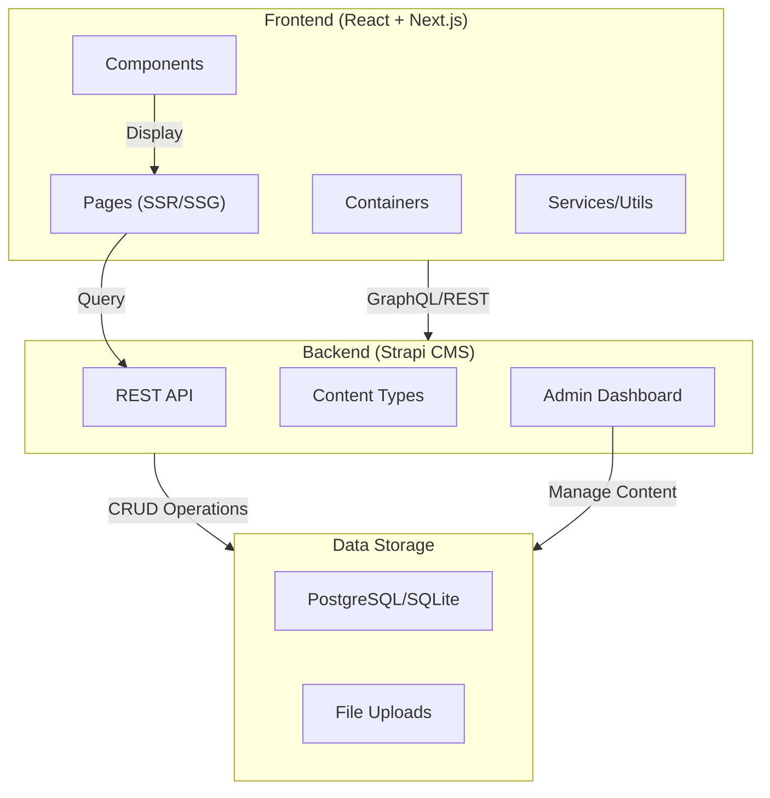

# 🚀 Developer Portfolio CMS

<div align="center">

**Built with Strapi & React** | *A Modern Headless CMS Solution for Developer Portfolios*

[](https://nextjs.org/)
[](https://reactjs.org/)
[](https://strapi.io/)
[](https://www.typescriptlang.org/)
[](https://getbootstrap.com/)
[](./LICENSE)

[🌐 Live Demo](#) • [📚 Documentation](#) • [🐛 Report Issue](#) • [💡 Request Feature](#)

</div>

---

## 📖 Table of Contents

- [Overview](#overview)
- [ℨFeatures](#features)
- [🏗️ Architecture](#architecture)
- [💾 Tech Stack](#tech-stack)
- [🚀 Quick Start](#quick-start)
- [📁 Project Structure](#project-structure)
- [🔧 Configuration](#configuration)
- [📡 API Integration](#api-integration)
- [🎨 Customization](#customization)
- [🤝 Contributing](#contributing)
- [📄 License](#license)
- [👤 Author](#author)

---

## 🎯 Overview

This is a **professional developer portfolio template** built as a **headless CMS solution** using **Strapi** as the backend and **React + Next.js** as the frontend. It provides a seamless way to manage and showcase your professional profile, projects, skills, education, and experience.

The portfolio is fully customizable, SEO-optimized, and comes with a built-in content management system that eliminates the need for manual updates to static files.

### Why This Approach?

| Traditional Approach | Our CMS Solution |
|---|---|
| ❌ Manual content updates | ✅ Strapi Admin Dashboard |
| ❌ Redeploy on every change | ✅ Update in real-time |
| ❌ Limited scalability | ✅ Fully scalable API |
| ❌ Hard to maintain | ✅ Clean separation of concerns |

---

## ✨ Features

- **📝 Headless CMS** - Manage all content from Strapi admin panel
- **⚡ Next.js** - Production-ready React framework with SSR/SSG
- **🎨 Responsive Design** - Mobile-first Bootstrap 5 styling
- **📊 SEO Optimized** - Structured data and meta tags
- **🏆 Multiple Sections** - Greetings, Skills, Projects, Education, Experience, Feedback
- **🎭 Animations** - Smooth transitions with Lottie animations
- **🔗 Social Integration** - GitHub, LinkedIn, Twitter links
- **⚙️ Type-Safe** - Full TypeScript support
- **📱 Progressive Web App** - Works offline with service workers
- **🚀 Performance** - Optimized bundle sizes and lazy loading

---

## 🏗️ Architecture



### Data Flow

1. **Content Creation** → Manage content via Strapi Admin Dashboard
2. **API Exposure** → Strapi exposes REST/GraphQL endpoints
3. **Frontend Query** → Next.js fetches data at build or request time
4. **Rendering** → React components render dynamic content
5. **User Experience** → Fully interactive and responsive portfolio

---

## 💾 Tech Stack

### Frontend
- **Framework**: Next.js 13.2.1 (React 18.2.0)
- **Language**: TypeScript 5.0
- **Styling**: Bootstrap 5.0.2 + Custom CSS
- **UI Components**: Custom React components
- **Animations**: Lottie React
- **Icons**: Iconify React
- **State Management**: Apollo Client 3.3.21

### Backend
- **CMS**: Strapi (Headless CMS)
- **Database**: PostgreSQL / SQLite
- **API**: RESTful + GraphQL

### DevTools
- **Package Manager**: npm
- **Linting**: ESLint
- **Formatting**: Prettier
- **Build Tool**: Next.js built-in webpack

### Hosting & Deployment
- **Frontend**: Vercel, Netlify, or Docker
- **Backend**: Heroku, AWS, DigitalOcean, or Docker
- **Database**: AWS RDS, Heroku Postgres

---

## 🚀 Quick Start

### Prerequisites

```bash
Node.js >= 14.x
npm >= 6.x
Strapi CMS Backend (running locally or hosted)
```

### Installation

1. **Clone the repository**
   ```bash
   git clone https://github.com/sohaib1113/developer-portfolio.git
   cd developer-portfolio
   ```

2. **Install dependencies**
   ```bash
   npm install
   ```

3. **Configure environment variables**
   ```bash
   cp .env.example .env.local
   # Edit .env.local with your Strapi API URL
   ```

4. **Start development server**
   ```bash
   npm run dev
   ```
   Open [http://localhost:3000](http://localhost:3000) to view it in the browser.

### Build for Production

```bash
npm run build
npm start
```

---

## 📁 Project Structure

```
developer-portfolio/
├── components/              # Reusable React components
│   ├── Alerts.tsx          # Alert notifications
│   ├── DisplayLottie.tsx    # Lottie animation wrapper
│   ├── EducationCard.tsx    # Education display
│   ├── ExperienceCard.tsx   # Experience display
│   ├── FeedbackCard.tsx     # Testimonials
│   ├── GithubProfileCard.tsx # GitHub stats
│   ├── Navigation.tsx       # Header navigation
│   ├── ProjectsCard.tsx     # Project showcase
│   ├── SEO.tsx             # SEO meta tags
│   ├── SocialLinks.tsx      # Social media links
│   └── types.ts            # Component types
│
├── containers/              # Page section containers
│   ├── Education.tsx        # Education section logic
│   ├── Experience.tsx       # Experience section logic
│   ├── Feedbacks.tsx        # Feedback section logic
│   ├── Greetings.tsx        # Hero section
│   ├── Proficiency.tsx      # Skills proficiency
│   ├── Projects.tsx         # Projects section
│   └── Skills.tsx           # Skills showcase
│
├── pages/                   # Next.js pages
│   ├── _app.tsx            # App wrapper
│   └── index.tsx            # Home page
│
├── public/                  # Static assets
│   ├── fonts/              # Custom fonts
│   ├── img/                # Images
│   ├── lottie/             # Lottie animations
│   ├── manifest.json       # PWA manifest
│   └── robots.txt          # SEO robots
│
├── styles/                  # Global & component styles
│   ├── argon-design-system-react.css
│   ├── styles.css
│   └── vendor/             # Third-party styles
│
├── types/                   # TypeScript type definitions
│   ├── index.ts            # Root types
│   ├── sections.ts         # Section types
│   └── react-reveal/       # Type definitions
│
├── portfolio.ts             # Strapi API integration
├── next.config.js          # Next.js configuration
├── tsconfig.json           # TypeScript config
├── package.json            # Dependencies
└── Dockerfile              # Docker configuration
```

---

## 🔧 Configuration

### Environment Variables

Create `.env.local` file in the root directory:

```env
# Strapi API Configuration
NEXT_PUBLIC_STRAPI_API_URL=http://localhost:1337
NEXT_PUBLIC_STRAPI_API_TOKEN=your_strapi_api_token

# Optional: GraphQL endpoint
NEXT_PUBLIC_GRAPHQL_URL=http://localhost:1337/graphql

# Site Configuration
NEXT_PUBLIC_SITE_URL=https://yourdomain.com
NEXT_PUBLIC_SITE_NAME=Your Name

# Analytics (Optional)
NEXT_PUBLIC_GA_ID=your_google_analytics_id
```

### Customize Portfolio

Edit `portfolio.ts` to configure:
- API endpoints
- Content population strategy
- Data transformation logic

---

## 📡 API Integration

### Strapi Content Types

The portfolio manages these content types:

```typescript
- Greeting        // Hero section content
- OpenSource      // Open source contributions
- Contact         // Contact information
- SEO             // Meta tags & SEO data
- SkillsSection   // Skills with categories
- Education       // Educational background
- Experience      // Work experience
- Project         // Portfolio projects
- Feedback        // Client testimonials
- SkillBar        // Skill proficiency bars
```

### Example API Call

```typescript
import documents from "./portfolio";

// Fetch all greeting data
const greetingData = await documents.find(ctx);
```

### Apollo Client Setup

```typescript
import { ApolloClient, InMemoryCache } from "@apollo/client";

const client = new ApolloClient({
  uri: process.env.NEXT_PUBLIC_GRAPHQL_URL,
  cache: new InMemoryCache(),
});
```

---

## 🎨 Customization

### Change Color Scheme

Edit `styles/styles.css`:

```css
:root {
  --primary-color: #your-color;
  --secondary-color: #your-color;
  --accent-color: #your-color;
}
```

### Add New Sections

1. Create content type in Strapi
2. Add component in `components/`
3. Create container in `containers/`
4. Update the page in `pages/index.tsx`
5. Define TypeScript types in `types/`

### Deploy Animations

Add JSON animation files to `public/lottie/` and reference in `DisplayLottie.tsx`

---

## 🤝 Contributing

Contributions are welcome! Follow these steps:

1. **Fork the repository**
   ```bash
   git clone https://github.com/yourusername/portfolio.git
   ```

2. **Create a feature branch**
   ```bash
   git checkout -b feature/your-feature
   ```

3. **Make your changes**
   ```bash
   npm run lint:fix
   npm run prettier:fix
   ```

4. **Commit with clear messages**
   ```bash
   git commit -m "feat: add your feature"
   ```

5. **Push and create a Pull Request**
   ```bash
   git push origin feature/your-feature
   ```

### Code Quality

- Follow ESLint rules
- Use Prettier for formatting
- Write TypeScript for type safety
- Document complex functions

---

## 📄 License

This project is licensed under the **MIT License** - see the [LICENSE](./LICENSE) file for details.

---

## 👤 Author

**Syed Sohaib** - Created with ❤️ for developers

- 🌐 [Portfolio](https://sohaibs.great-site.net/)
- 💼 [LinkedIn](in/sohaib-syed-63282416a)
- 🐙 [GitHub](https://github.com/Sohaib1113)
- 🐦 [Twitter](#)
- 📧 Email: amaans113@gmail.com

---

## 🙏 Acknowledgments

- Built with [Strapi](https://strapi.io/)
- Powered by [Next.js](https://nextjs.org/)
- Designed with [Bootstrap](https://getbootstrap.com/)
- Icons by [Iconify](https://iconify.design/)

---

## 📚 Additional Resources

- [Strapi Documentation](https://docs.strapi.io/)
- [Next.js Documentation](https://nextjs.org/docs)
- [React Documentation](https://react.dev/)
- [TypeScript Handbook](https://www.typescriptlang.org/docs/)

---

<div align="center">

**Made with ❤️ by Syed Sohaib**

If you found this helpful, please give it a ⭐!

</div>
